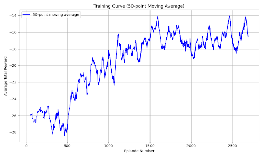

**Summary**
Our project involves training a reinforcement learning (RL) agent to play the game *Cuphead*, specifically to defeat the Root Pack boss fight. We use a YOLO object detection model to analyze the game's screen in real-time, then feed the data through a Deep-Q Network (DQN) which learns to make optimal decisions and execute inputs based on the observed state of the game. The project aims to explore the challenges of training AI in fast-paced, visually complex environments such as video games.

## This video contains the winning run of the CupBot RL Agent beating The Root Pack Boss (No Talking)
<iframe width="578" height="326" src="https://www.youtubeeducation.com/embed/LerQo3rzL9k" title="CupBot CupWins" frameborder="0" allow="accelerometer; autoplay; clipboard-write; encrypted-media; gyroscope; picture-in-picture; web-share" referrerpolicy="strict-origin-when-cross-origin" allowfullscreen></iframe>

## This graph plots 50 episode moving-average of total rewards. An episode is a singular run of the boss battle.

## This video discusses the implementation process
<iframe width="560" height="315" src="https://www.youtube.com/embed/LJXqEdy_ocg?si=0piAyGilAccg_3GJ" title="YouTube video player" frameborder="0" allow="accelerometer; autoplay; clipboard-write; encrypted-media; gyroscope; picture-in-picture; web-share" referrerpolicy="strict-origin-when-cross-origin" allowfullscreen></iframe>