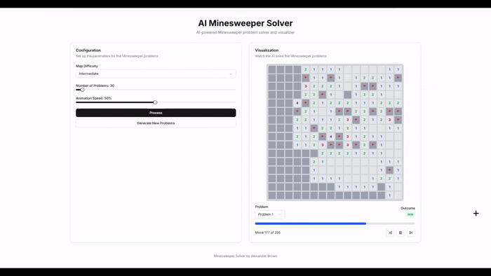

# Minesweeper Solver

This project consists of a React frontend and a Python FastAPI backend that work together to visualize an AI solving Minesweeper puzzles.

## AI Algorithm
My minesweeper solver uses a multitude of different strategies listed below:
- Uses set pair subtraction and division to find guaranteed solutions
   - This video helps explain how to implement this algorithm: [How do you solve Minesweeper?](https://www.youtube.com/watch?v=8j7bkNXNx4M&t=556s)
- Uses forward checking and backtracking to find probability of tiles being safe or bombs
- When no moves are guaranteed, uses a baysian tree algorithm to balance probability of a move being safe and the amount of information it will provide. This is a utilization ratio heuristic
- When the frontiers grow large, limit the time spent on calculating all probabilities and make predictions on estimated probabilities

## Features
- Generate Minesweeper puzzles with different difficulty levels and sizes
- Watch the AI solve the puzzles step by step
- Control playback speed and navigate through moves
- View the outcome of each puzzle (win/lose)

## Project Structure

- `frontend/`: Next.js React application
- `backend/`: FastAPI Python application with the Minesweeper solver

## Setup Instructions

### Using Docker Compose (Recommended)

1. Make sure you have Docker and Docker Compose installed
2. Clone this repository
3. Run `docker-compose up` in the root directory
4. Access the application at http://localhost:3000

### Manual Setup

#### Backend
1. Navigate to the `backend/` directory
2. Create a virtual environment: `python -m venv venv`
3. Activate the virtual environment:
   - Windows: `venv\Scripts\activate`
   - macOS/Linux: `source venv/bin/activate`
4. Install dependencies: `pip install -r requirements.txt`
5. Run the server: `uvicorn main:app --reload`

#### Frontend
1. Make sure you have Node.js installed
2. Navigate to the root directory
3. Install dependencies: `npm install`
4. Set the API_URL environment variable to point to your backend
5. Run the development server: `npm run dev`